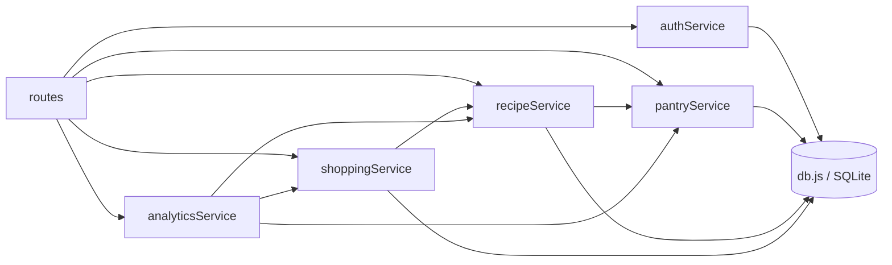

# Component design

The app is built from small, single-purpose components that are reused across
screens. Nothing is duplicated: every screen is assembled from the same shell,
form, table, badge and button pieces, and every route goes through the same
guard, validation and service components.

## Layout components (views/partials/)

| Component | Purpose | Reused by |
|---|---|---|
| `head.ejs` | App shell: renders the sidebar navigation for logged-in pages or the centered auth layout for public pages, from one template | all 11 screens |
| `foot.ejs` | Closes the shell and loads the client script | all 11 screens |
| `flash.ejs` | One-time status/error messages pulled from the session | every screen, automatically via `head.ejs` |

The shell decides its layout from `res.locals.user`, which is set once in
`app.js` middleware — no screen passes login state around by hand.

## UI components (public/styles.css)

One design system, defined once as CSS components and design tokens
(colors, radius, type scale in `:root`), used by every screen:

| Component | Purpose | Reused by |
|---|---|---|
| `.btn` (primary / plain / danger / small / block) | Every action in the app, one button vocabulary | all screens |
| `.field` + `.field-error` + `.hint` | Labeled input with inline validation message | login, register, add item, edit item |
| `.badge` (soon / expired / ready / neutral) | Status chips for expiry and recipe readiness | inventory, dashboard, recipes |
| `.stats` / `.stat` | Stat strip of headline numbers | dashboard, analytics |
| `.panel` | Titled content section | dashboard, recipes, recipe details, analytics |
| `.empty` | Empty state that tells the user what to do next | every list screen |
| `.filters` | Horizontal filter/search bar | inventory, recipes, shopping |
| table styles | Data tables with hover and action column | dashboard, inventory, recipes, shopping |
| `.bar`, `.stack`, `.legend`, `.dot` | CSS-only charts | analytics |
| `.check` | Toggleable bought/not-bought checkbox | shopping |

## Middleware components (src/middleware/, app.js)

| Component | Purpose | Reused by |
|---|---|---|
| `requireLogin` | Session guard, redirects anonymous users to /login | every protected route (dashboard, inventory, recipes, shopping, analytics) |
| `validate.js` (`isEmail`, `required`, `minLength`, `isPositiveNumber`, `isDate`) | Input validation helpers | auth routes, pantry routes, shopping routes |
| locals middleware (`app.js`) | Exposes `user` and `flash` to every view | all renders |
| `db.js` | Single SQLite connection that runs the schema on startup | all services, seed script, tests |

## Functional components (src/services/)

Each service owns one responsibility and hides the database behind functions.
Routes never write SQL.

| Component | Responsibility | Reused by |
|---|---|---|
| `authService` | Register, verify, look up users; bcrypt hashing | auth routes, seed script, tests |
| `pantryService` | Inventory CRUD, search/filters, expiry status (`statusOf`), duplicate merge, stats, CSV | pantry routes, dashboard, recipeService, analyticsService |
| `recipeService` | Match scoring, filters, missing-ingredient computation, saved recipes | recipe routes, dashboard, shoppingService, analyticsService |
| `shoppingService` | Deduplicated list, add-missing-from-recipe, bought toggle, CSV | shopping routes, analyticsService |
| `analyticsService` | Aggregates everything into one summary | analytics route |

Component dependencies flow one way (routes -> services -> db), so any piece
can be replaced without touching the others:

## Data components

| Component | Purpose |
|---|---|
| `schema.sql` | Four tables: users, pantry_items, saved_recipes, shopping_items |
| `data/recipes.json` | Curated recipe dataset consumed by recipeService |
| `seed.js` | Rebuilds the demo account and sample pantry, safe to re-run |

## Why it's designed this way

- **High cohesion** — each service/module does one thing (auth doesn't know
  about pantries; recipes don't know about sessions).
- **Low coupling** — screens talk to routes, routes talk to services, services
  talk to the database. Swapping SQLite for a hosted database only touches
  `db.js` and the services' queries.
- **Reuse over repetition** — one button system, one form pattern, one table
  pattern, one guard, one validation toolkit. Adding a new screen means
  composing existing pieces, which is how the shopping screen was built after
  inventory and recipes existed.
